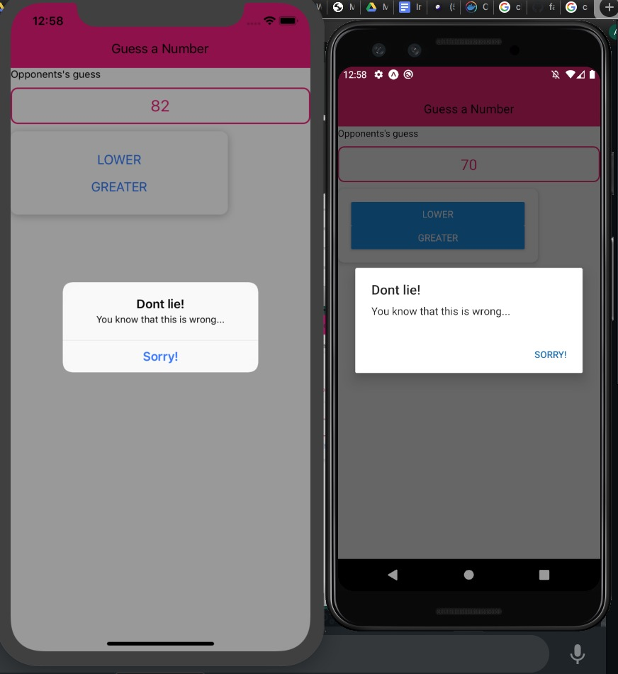

# Nombre de la aplicacion: GuessNumber

## Escritor: Alfredo Polanco
Ingenieria de software

## Requerimientos:

1. Visual Studio Code 
2. React 16.31.1
3. React Native 0.36.2
4. NPM 6.14.8
5. Expo 39.0.2
6. Emulador Android o iOS
7. Telefono Android o iOS

## Ejecucion:

1. Crear carpeta para descargar el proyecto

2. Clonar el repositorio 

    - git clone https://github.com/AlfredPolanco/GuessGame-ReactNtive.git

3. Acceder a la carpeta creada

    - cd /Carpeta/NombreCarpeta

4. Abrir .md con visual studio 

    - `code .`
       
5. Ejecutar el siguiente comando en la terminal de VS Code
   - `npm start`
  
6. Emular la app o abrir en el telefono usando Expo
   
7. Disfrutar del juego.

    
#

 
 
 
 
